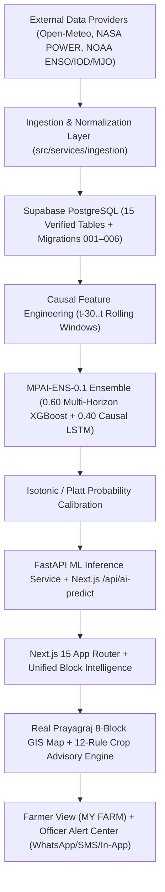

# MonsoonPulse AI 🌧️🌾

> **"Predict the Monsoon. Protect the Harvest."**
>
> *Block-level probabilistic monsoon intelligence that converts climate and weather signals into crop-specific agricultural decision support.*

---

## 1. Product Overview

**MonsoonPulse AI** is a block-level Indian monsoon intelligence, agricultural decision-support, and farmer communication platform engineered for **Prayagraj District, Uttar Pradesh** (`Karchhana`, `Phulpur`, `Meja`, `Koraon`, `Bara`, `Soraon`, `Handia`, `Chaka` blocks).

Unlike general district-wide weather apps, MonsoonPulse AI models the specific sub-seasonal hazards that destroy rainfed Kharif seed stock:
1. **Monsoon Onset Probability** (`7D`, `14D`, `21D`, `30D`)
2. **False Onset Risk** (an initial 15–18 June shower followed by an 8–11 day break-monsoon dry spell)
3. **Prolonged Dry Spell / Break-Monsoon Probability**
4. **Heavy Rainfall & Waterlogging Probability**
5. **Sub-Seasonal Rainfall Anomaly (`%`)**

It then translates these calibrated probabilities into **deterministic, crop-specific agricultural advisories** (`Paddy`, `Maize`, `Pulses`, `Soybean`, `Cotton`, `Wheat`) and delivers **bilingual (English + Unicode Hindi) farmer alerts** with full explainability, consent verification, and phone privacy masking.

---

## 2. System Architecture



---

## 3. Tech Stack

- **Frontend**: Next.js `15.1.6` (App Router), React `19`, TypeScript, Tailwind CSS, Recharts, Leaflet / React-Leaflet, Lucide React
- **Database**: Supabase (`PostgreSQL`) with 6 SQL migrations (`001` through `006`)
- **AI / ML Engine**: Python `3.12`, FastAPI, `scikit-learn`, `XGBoost`, PyTorch / NumPy causal `LSTM`, Isotonic Calibration (`MPAI-ENS-0.1`)
- **Testing**: `pytest` (`63+` automated unit, boundary, GIS, advisory, communication, and SIH readiness tests)

---

## 4. Setup & Environment Variables

1. Clone the repository and install Node dependencies:
   ```bash
   npm install
   ```
2. Copy `.env.example` to `.env.local`:
   ```bash
   cp .env.example .env.local
   ```
3. Configure environment variable groups in `.env.local`:
   - **SUPABASE**: `NEXT_PUBLIC_SUPABASE_URL`, `NEXT_PUBLIC_SUPABASE_ANON_KEY`, `SUPABASE_SERVICE_ROLE_KEY`
   - **WEATHER / RAINFALL / CLIMATE**: `OPEN_METEO_BASE_URL`, `NASA_POWER_BASE_URL`, `NOAA_ENSO_DATA_URL`
   - **AI SERVICE**: `ML_SERVICE_URL=http://127.0.0.1:8000`
   - **WHATSAPP / SMS**: Server-side credentials (`WHATSAPP_API_URL`, `WHATSAPP_ACCESS_TOKEN`, `SMS_API_URL`, `SMS_API_KEY`). Leave empty to run in honest `NOT_CONFIGURED` or Demo `SIMULATED DELIVERY` mode.
   - **GIS**: `NEXT_PUBLIC_GIS_BOUNDARY_PATH=/gis/prayagraj_blocks.geojson`

---

## 5. Running the Application

### Running Frontend (Next.js)
```bash
npm run dev
# Production build verification:
npm run build
npm start
```

### Running ML Service (FastAPI `MPAI-ENS-0.1`)
```bash
cd ml-service
uvicorn app.main:app --host 127.0.0.1 --port 8000
```

### Running Automated Test Suites
```bash
python -m pytest ml-service/tests/ -v
```

---

## 6. Core Subsystems

- **Supabase Setup**: Apply SQL migrations in `supabase/migrations/001_initial_schema.sql` through `006_sih_final_indexes.sql`.
- **Data Ingestion**: `POST /api/ingest` fetches, validates, and stores weather, rainfall, and climate indices with fallback safety.
- **AI Inference**: `POST /api/ai-predict` queries `MPAI-ENS-0.1` (`2019–2022` Train, `2023` Validation, `2024–2025` Held-Out Test, zero target leakage).
- **GIS Spatial Intelligence**: `/map` and `/api/gis/*` render real Prayagraj 8-block boundaries across 7 selectable risk layers.
- **Crop Advisory Engine**: `/advisories` and `src/services/advisoryEngine.ts` evaluate 12 deterministic rules across 6 crops (`Paddy`, `Maize`, `Pulses`, `Soybean`, `Cotton`, `Wheat`).
- **Farmer Alerts & Officer Alert Center**: `/farmers` and `/api/alerts/*` provide multi-crop farmer profiles (`farmer_crops`), priority scoring (`CRITICAL`, `HIGH`, `MODERATE`, `LOW`), phone masking (`+91 ******1234`), consent checks (`notification_enabled`), deduplication (`dedup_key`), and mandatory bulk send confirmation.
- **Demo Mode & Guided SIH Walkthrough**: Click **`RUN DEMO`** on `/dashboard` to step through the 7-stage guided sequence (`Climate Signal -> Local Observation -> AI Prediction -> GIS Risk -> Crop Advisory -> Farmer Alert -> Officer Response`) or **`RESET DEMO`** to restore default state cleanly.
