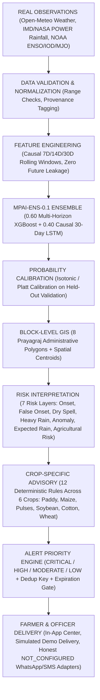

# MonsoonPulse AI — End-to-End System Architecture (`docs/ARCHITECTURE.md`)

> **"Predict the Monsoon. Protect the Harvest."**
>
> *Block-level probabilistic monsoon intelligence that converts climate and weather signals into crop-specific agricultural decision support.*

---

## 1. End-to-End Pipeline Diagram

---

## 2. Unified Block Intelligence Object (`src/services/unifiedBlockIntelligence.ts`)

To prevent discrepancies across the Dashboard, Risk Map, Forecast Page, Crop Advisories, and Farmer/Officer Alert Centers, every screen consumes the canonical `UnifiedBlockIntelligenceObject`:
- `block`: `{ location_id, name, district, state, coordinates }`
- `geometry`: `{ type: "Polygon", coordinates, centroid, source }`
- `observations`: `{ temperature_c, humidity_pct, soil_moisture_pct, cumulative_rain_7d_mm, rainfall_anomaly_pct, last_observation_timestamp }`
- `predictions`: `{ horizon, model_version: "MPAI-ENS-0.1", onset_probability_pct, false_onset_probability_pct, dry_spell_probability_pct, heavy_rain_probability_pct, expected_rainfall_mm, rainfall_anomaly_pct }`
- `rainfall`: `{ expected_mm, anomaly_pct, uncertainty_tier }`
- `risk`: `{ overall_level, dominant_hazard, false_onset_elevated, dry_spell_elevated, heavy_rain_elevated }`
- `advisories`: `AdvisoryEngineResult`
- `alerts`: `CommunicationAlertRecord[]`
- `provenance`: `{ badge: "REAL" | "SIMULATED" | "AI" | "DEMO", observation_mode, prediction_mode, scenario_id }`
- `explainable_ai`: `{ target_label, probability_pct, top_contributing_features, prediction_trace }`
