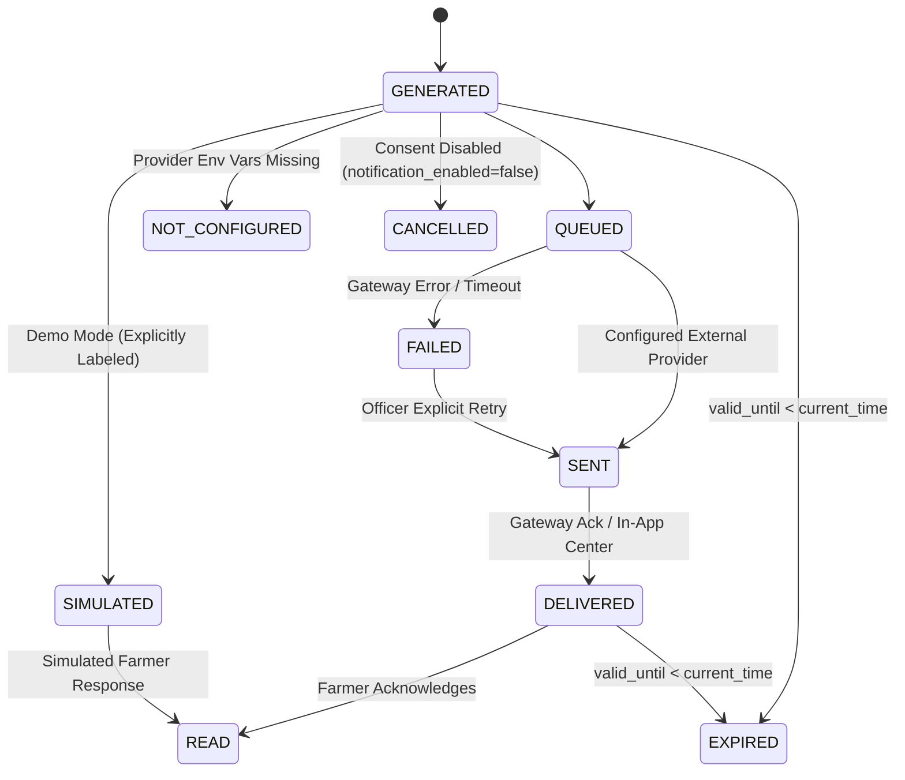

# MonsoonPulse AI — Farmer Communication, Alert Delivery & Officer Alert Center Architecture (`COMMUNICATION_ARCHITECTURE.md`)

This document specifies the complete architecture for **Prompt 9**: the farmer communication, alert prioritization, multilingual message generation, provider abstraction, delivery audit logging, deduplication, consent/privacy protection, and Officer Alert Center subsystem of **MonsoonPulse AI**.

---

## 1. Farmer Profile Model (`public.farmers`)

Each registered farmer is stored in `public.farmers` (defined in `supabase/migrations/004_communication_and_alerts.sql` and typed in `src/types/communication.ts`):

| Field | Type | Description |
| :--- | :--- | :--- |
| `id` | `TEXT PRIMARY KEY` | Unique farmer identifier (e.g., `frm-101` through `frm-105`) |
| `name` | `TEXT` | Farmer name in Latin script (`Ramesh Chandra Patel`) |
| `phone` | `TEXT` | Raw E.164 phone number stored server-side only (`+919451200084`); always masked in UI/logs (`+91 ******0084`) |
| `preferred_language` | `TEXT` | `"Hindi"` or `"English"` — drives automatic message generation |
| `location_id` | `TEXT` | Prayagraj Block ID (`karchhana`, `phulpur`, `meja`, `soraon`, `koraon`) |
| `preferred_channel` | `TEXT` | `"WhatsApp"`, `"SMS"`, or `"In-App"` |
| `notification_enabled` | `BOOLEAN` | Explicit farmer consent flag (`TRUE` / `FALSE`) |
| `active` | `BOOLEAN` | Account status (`TRUE` / `FALSE`) |
| `created_at` | `TIMESTAMPTZ` | Profile creation timestamp |
| `updated_at` | `TIMESTAMPTZ` | Last preference update timestamp |

---

## 2. Multi-Crop Farmer Mapping (`public.farmer_crops`)

A single farmer frequently cultivates multiple crops across different plots (`1 farmer → many crops`). The `public.farmer_crops` table links each farmer to multiple crops and growth stages:

| Field | Type | Description |
| :--- | :--- | :--- |
| `id` | `TEXT PRIMARY KEY` | Assignment ID (`fc-101-paddy`, `fc-101-pulses`, etc.) |
| `farmer_id` | `TEXT REFERENCES farmers(id)` | Foreign key to `public.farmers` |
| `crop_id` | `TEXT` | Crop identifier (`paddy`, `pulses`, `maize`, `soybean`, `cotton`, `millets`) |
| `crop_stage` | `TEXT` | Current crop phenology (`sowing`, `nursery`, `vegetative`, `flowering`, `harvest`) |
| `sowing_date` | `DATE` | Recorded or planned sowing date |
| `created_at` / `updated_at` | `TIMESTAMPTZ` | Audit timestamps |

**Multi-Crop Example (`frm-101` — Ramesh Chandra Patel, Karchhana Block):**
- `fc-101-paddy`: **Paddy / Rice** (`sowing` stage) → receives Paddy nursery irrigation & false-onset sowing delay advisory.
- `fc-101-pulses`: **Pulses (Arhar/Urad/Moong)** (`sowing` stage) → receives ridge-furrow drainage & waterlogging caution advisory.

---

## 3. Alert Lifecycle (`public.alerts`)

Every alert transitions through a strictly validated state machine stored in `public.alerts`:



Supported lifecycle statuses:
- `GENERATED`
- `QUEUED`
- `SENT`
- `DELIVERED`
- `READ`
- `FAILED`
- `EXPIRED`
- `SIMULATED`
- `CANCELLED`
- `NOT_CONFIGURED`

---

## 4. Transparent Alert Priority Rules (`src/services/alertPriorityService.ts`)

`evaluateAlertPriority()` classifies monsoon risk into `CRITICAL`, `HIGH`, `MODERATE`, or `LOW` using deterministic thresholds:

1. **`CRITICAL`**:
   $$\text{false\_onset\_risk} \ge 0.75 \;\lor\; \text{heavy\_rain\_risk} \ge 0.70 \;\lor\; (\text{dry\_spell\_risk} \ge 0.70 \land \text{soil\_moisture\_low})$$
2. **`HIGH`**:
   $$\text{false\_onset\_risk} \ge 0.60 \;\lor\; \text{dry\_spell\_risk} \ge 0.60 \;\lor\; \text{heavy\_rain\_risk} \ge 0.55$$
3. **`MODERATE`**:
   $$\text{false\_onset\_risk} \ge 0.45 \;\lor\; \text{dry\_spell\_risk} \ge 0.45 \;\lor\; \text{heavy\_rain\_risk} \ge 0.40$$
4. **`LOW`**:
   All other conditions below `MODERATE` thresholds.

---

## 5. Message Template Structure (`src/services/messageGenerator.ts`)

All farmer messages are generated deterministically from approved templates—never unconstrained free-form LLM text—and always include 7 structured sections:
1. **Location** (`Karchhana Block, Prayagraj` / `Karchhana ब्लॉक, Prayagraj`)
2. **Crop** (`Paddy / Rice (sowing stage)` / `धान (Paddy) (बुवाई चरण)`)
3. **Situation** (Plain-language summary of false onset, dry spell, or heavy rain risk)
4. **Forecast Horizon** (`Next 7–14 days (14D)` / `अगले 7–14 दिन (14D)`)
5. **Recommended Action** (Concrete agronomic action from `advisoryEngine.ts`)
6. **Important Caution** (What to avoid, e.g., avoiding premature dry-seed commitment)
7. **Source / Provenance** (`MonsoonPulse AI Advisory (Verified AI Forecast)` / `MonsoonPulse AI कृषि सलाह`)

**Zero ML Jargon Enforcement**: `validateFarmerMessageSafety()` verifies that no message contains `LSTM`, `XGBoost`, `Brier score`, `calibration curve`, or `z-score`.

---

## 6. English and Hindi Templates

### English Template Example
```text
MonsoonPulse AI Advisory — Karchhana Block, Prayagraj
Crop: Paddy / Rice (sowing stage)
Situation: High risk of false monsoon onset (68%) followed by an 8–11 day dry spell.
Horizon: Next 7–14 days (14D)
Action: Delay direct sowing by 5–7 days, keep paddy nursery irrigated, and conserve farm pond water.
Caution: Avoid rainfed sowing immediately after the initial shower until sustained moisture is confirmed.
Source: MonsoonPulse AI Advisory (Verified AI Forecast)
```

### Hindi (Unicode) Template Example
```text
🌾 मानसून कृषि सलाह — Karchhana ब्लॉक, Prayagraj
फसल: धान (Paddy) (बुवाई चरण)
स्थिति: शुरुआती बारिश के बाद 8–11 दिन के सूखे अंतराल (False Onset: 68%) की उच्च संभावना है।
अवधि: अगले 7–14 दिन (14D)
सलाह: वर्षा आधारित सीधी बुवाई 5–7 दिन टालें और जीवनरक्षक सिंचाई की तैयारी रखें।
सावधानी: स्थायी मिट्टी नमी की पुष्टि किए बिना महंगे बीज और खाद का प्रयोग न करें।
स्रोत: MonsoonPulse AI कृषि सलाह (सत्यापित पूर्वानुमान)
```

---

## 7. Provider Abstraction (`whatsappProvider.ts` & `smsProvider.ts`)

External messaging providers are abstracted behind server-side adapters:
- `src/services/providers/whatsappProvider.ts` (`sendWhatsAppMessage()`)
- `src/services/providers/smsProvider.ts` (`sendSMSMessage()`)

---

## 8. WhatsApp and SMS Readiness & Honest `NOT_CONFIGURED` Behavior

Server-side environment variables (never prefixed with `NEXT_PUBLIC_`):
- `WHATSAPP_PROVIDER`, `WHATSAPP_API_URL`, `WHATSAPP_ACCESS_TOKEN`
- `SMS_PROVIDER`, `SMS_API_URL`, `SMS_API_KEY`

When credentials are not configured:
- `sendWhatsAppMessage({ simulate: false })` returns:
  - `status: "NOT_CONFIGURED"`
  - `reason: "External WhatsApp provider is not configured. Message preview generated only."`
- `sendSMSMessage({ simulate: false })` returns:
  - `status: "NOT_CONFIGURED"`
  - `reason: "External SMS gateway is not configured. Message preview generated only."`
- Real WhatsApp or SMS delivery is **never fabricated**.

---

## 9. Delivery Status & Audit Logging (`public.alert_delivery_logs`)

Every dispatch attempt writes an immutable record to `alert_delivery_logs` containing:
- `id`, `alert_id`, `provider`, `request_timestamp`, `response_timestamp`, `provider_message_id`, `status`, `error_code`, `error_message`.

---

## 10. Deduplication Logic

`buildAlertDedupKey()` constructs a deterministic key:
$$\text{dedup\_key} = \texttt{farmer\_id}:\texttt{advisory\_id}:\texttt{forecast\_issue\_time}:\texttt{channel}$$
If an alert with the same `dedup_key` has already been dispatched, `dispatchSingleAlert()` suppresses the duplicate (`duplicate_suppressed: true`, `delivery_mode_badge: "DUPLICATE SUPPRESSED"`) unless an officer explicitly invokes `forceResend: true` (`POST /api/alerts/[id]/retry`).

---

## 11. Expiration Logic

`isAlertExpired(validUntilIso, now)` compares `expires_at` against the current timestamp. Whenever `expires_at < now`, the alert automatically transitions to `status: "EXPIRED"` and is blocked from active dispatch.

---

## 12. Consent and Privacy Safeguards

1. **Consent Gate (`verifyFarmerConsent`)**: If `farmer.notification_enabled === false`, dispatch is blocked immediately with `status: "CANCELLED"` and reason `"Notifications disabled by farmer."`
2. **Phone Number Masking (`maskPhoneNumber`)**: Subscriber numbers are masked to `+91 ******1234` across all UI components, API responses, and audit logs.

---

## 13. Rate Limiting (`checkDispatchRateLimit`)

Server-side anti-spam rate limiting enforces:
- Maximum `5` alerts per farmer per `10-minute` rolling window.
- Maximum `5` bulk dispatch jobs per `1-minute` rolling window.

---

## 14. Demo vs. Configured Provider Modes

| Mode | Trigger | Status Stored | UI Badge Displayed | External HTTP Sent? |
| :--- | :--- | :--- | :--- | :--- |
| **In-App Notification Center** | `channel === "In-App"` | `DELIVERED` | `IN-APP DELIVERED` | No (Internal App Store) |
| **Demo Mode Simulation** | `simulate === true` | `SIMULATED` | `SIMULATED DELIVERY` | No (Logged as Simulation) |
| **Unconfigured Live Check** | `simulate === false` (No Env Keys) | `NOT_CONFIGURED` | `NOT_CONFIGURED` | No (Honest Unconfigured State) |
| **Configured Live Gateway** | `simulate === false` (Valid Env Keys) | `SENT` / `DELIVERED` | `PROVIDER DELIVERED` | Yes (Authenticated POST) |
